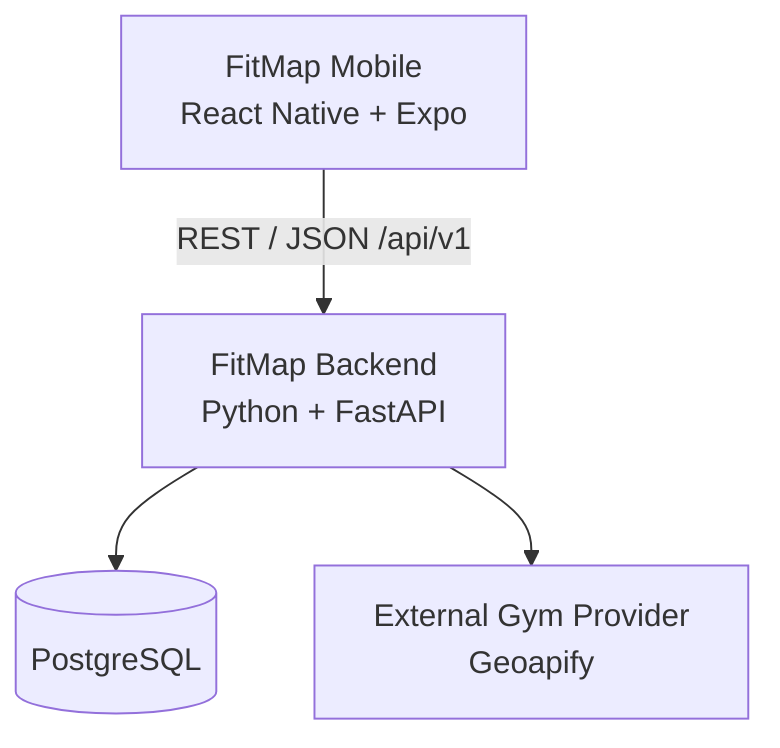

<div align="center">


# FitMap

**Mobile fitness platform for gym discovery and progressive workout tracking.**

React Native + Expo mobile application backed by a Python/FastAPI API, PostgreSQL persistence, automated validation and containerized delivery foundations.

</div>

## Overview

FitMap is a mobile fitness platform designed to help users discover gyms and progressively manage their training experience in a single application.

The project started as an academic mobile prototype and is evolving into a full application with its own backend, relational database, external-service integration, automated testing and documented architecture.

The current implementation already provides a backend-integrated gym discovery experience while legacy prototype features are being migrated incrementally to the new architecture.

FitMap is under active development as a Trabalho de Conclusão de Curso (TCC).

## Current capabilities

### Gym discovery

The current gym-discovery flow is integrated with the FitMap backend.

Users can:

- search for gyms by city, neighborhood or region;
- request nearby gyms using the device's current location;
- view results in an interactive map;
- view results in a synchronized list;
- select gyms from either the map or list;
- view distance information when valid coordinates are available;
- open a dedicated gym-details screen;
- access available address, phone and website information;
- open directions using the gym's coordinates or address;
- continue using textual search when location permission is denied;
- receive clear empty, timeout, backend-unavailable and provider-unavailable states.

External gym data is accessed by the backend through a provider abstraction. The mobile application does not communicate directly with the external gym provider and does not contain the provider API key.

### Gym details

Gym details are retrieved through the FitMap API.

When the provider supplies the information, the application can display:

- gym name;
- address;
- coordinates;
- phone;
- website;
- opening hours;
- available amenities;
- available images.

Unavailable external information remains unavailable instead of being replaced with fabricated production values.

### Current prototype authentication

The repository still contains the original local authentication flow used by the mobile prototype.

Registration, login and the local session currently use AsyncStorage.

This implementation is temporary and must not be interpreted as the final FitMap security model. Secure backend-managed authentication is tracked separately and will replace local password storage.

### Current prototype exercise flow

The legacy mobile prototype also contains a local exercise-tracking flow.

Users can currently:

- create an exercise entry;
- add a description;
- mark an exercise as completed or pending;
- delete an exercise;
- capture a photo for an exercise;
- associate the captured photo with the local exercise record.

These records currently remain device-local through AsyncStorage.

The structured workout-planning, workout-session, training-history and progress domains defined by the FitMap architecture are separate future implementation work and are not represented as completed backend functionality.

## Architecture

FitMap uses a mobile client with a dedicated backend API.



The backend follows a modular-monolith architecture with four primary business boundaries:

```text
Identity
Gyms
Training
Progress
```

These boundaries represent the approved architecture of the platform.

Their implementation is incremental. At the current project stage, the Gyms integration and the common backend/persistence foundations are substantially further developed than the Identity, Training and Progress business features.

### Mobile

The mobile application uses React Native and Expo.

New production mobile code uses TypeScript by default. Existing JavaScript files are being migrated incrementally rather than through a full rewrite.

Backend communication is centralized through the mobile API-client layer.

Supported platforms:

- Android;
- iOS.

The web target is not currently considered a supported FitMap platform.

### Backend

The backend uses Python 3.13 and FastAPI.

Current backend responsibilities include:

- versioned REST API routing;
- gym search by textual location;
- nearby gym discovery;
- gym detail retrieval;
- external gym-provider isolation;
- standardized API errors;
- PostgreSQL connectivity;
- health and readiness endpoints;
- environment-based configuration;
- database migration infrastructure.

Current system endpoints:

```text
GET /health
GET /ready
```

Current gym API endpoints under `/api/v1`:

```text
GET /gyms/search
GET /gyms/nearby
GET /gyms/{external_id}
```

Interactive FastAPI documentation is available locally at:

```text
http://127.0.0.1:8000/docs
```

### Persistence

PostgreSQL is the primary relational database.

The backend uses:

- SQLAlchemy for relational persistence infrastructure;
- Psycopg for PostgreSQL connectivity;
- Alembic for versioned schema migrations.

Database migrations are explicit operations and are not automatically executed every time the API starts.

### External gym provider

Gym-provider access is isolated behind the backend.

The current implementation uses Geoapify through an internal provider adapter.

Provider-specific response structures remain outside the mobile application and outside FitMap's persistent domain identity.

The Geoapify API key is backend-only configuration and must never be stored in the distributed mobile application.

## Technology stack

### Mobile

- React Native 0.86
- Expo 57
- React 19
- TypeScript
- React Navigation
- React Native Maps
- Expo Location
- Expo Camera
- AsyncStorage
- Jest
- React Native Testing Library
- ESLint
- Prettier

### Backend

- Python 3.13
- FastAPI
- Pydantic Settings
- SQLAlchemy 2
- PostgreSQL
- Psycopg
- Alembic
- Uvicorn
- httpx2
- pytest
- Ruff
- Pyright

### Infrastructure and delivery

- Docker
- Docker Compose
- GitHub Actions
- GitHub Container Registry
- Git / GitHub

## Repository structure

```text
fitmap-mobile/
├── .github/
│   ├── pull_request_template.md
│   └── workflows/
│       ├── ci.yml
│       └── backend-image.yml
│
├── assets/
│   └── images/
│
├── backend/
│   ├── alembic/
│   │   └── versions/
│   ├── src/
│   │   └── fitmap/
│   │       ├── api/
│   │       ├── gyms/
│   │       ├── identity/
│   │       ├── persistence/
│   │       ├── progress/
│   │       └── training/
│   ├── tests/
│   ├── .env.example
│   ├── Dockerfile
│   ├── compose.yaml
│   ├── compose.test.yaml
│   ├── pyproject.toml
│   └── uv.lock
│
├── docs/
│   ├── architecture/
│   │   ├── decisions/
│   │   ├── domain-model.md
│   │   └── high-level-architecture.md
│   ├── requirements/
│   ├── deployment.md
│   ├── mobile-development.md
│   └── testing.md
│
├── src/
│   ├── components/
│   ├── config/
│   ├── context/
│   ├── navigation/
│   ├── screens/
│   ├── services/
│   └── utils/
│
├── .env.example
├── App.js
├── app.json
├── CONTRIBUTING.md
├── package.json
├── package-lock.json
└── tsconfig.json
```

## Prerequisites

For the complete local development workflow, install:

- Git;
- Node.js;
- npm;
- Python 3.13;
- uv;
- Docker Desktop with Docker Compose.

For physical-device mobile development, also install Expo Go on the device.

The development machine and physical device normally need network connectivity that allows the device to reach the backend running on the computer.

## Local development setup

The mobile application and backend have separate dependencies and environment files.

### 1. Clone the repository

```bash
git clone https://github.com/gumautoni/fitmap-mobile.git
cd fitmap-mobile
```

### 2. Install mobile dependencies

From the repository root:

```bash
npm ci
```

### 3. Configure the mobile environment

Create the local mobile environment file.

On Windows PowerShell:

```powershell
Copy-Item .env.example .env
```

Configure:

```env
EXPO_PUBLIC_API_URL=http://YOUR_LOCAL_IP:8000/api/v1
```

When using a physical phone, replace `YOUR_LOCAL_IP` with the local-network IP address of the computer running the backend.

Example:

```env
EXPO_PUBLIC_API_URL=http://192.168.0.15:8000/api/v1
```

`EXPO_PUBLIC_` variables are bundled into the client application and therefore must never contain secrets.

### 4. Install backend dependencies

Enter the backend directory:

```bash
cd backend
```

Install the locked environment:

```bash
uv sync
```

### 5. Configure the backend environment

Create the local backend environment file.

On Windows PowerShell:

```powershell
Copy-Item .env.example .env
```

The development configuration includes:

```env
FITMAP_ENVIRONMENT=development
FITMAP_LOG_LEVEL=INFO

FITMAP_DB_HOST=127.0.0.1
FITMAP_DB_PORT=5433
FITMAP_DB_NAME=fitmap
FITMAP_DB_USER=fitmap
FITMAP_DB_PASSWORD=change-me-local

FITMAP_GEOAPIFY_API_KEY=replace-with-geoapify-api-key
FITMAP_GEOAPIFY_TIMEOUT_SECONDS=5.0
```

Use a valid Geoapify API key locally for real gym-provider requests.

Never commit the local `.env` file or real credentials.

### 6. Start PostgreSQL

From the `backend` directory:

```bash
docker compose up -d postgres
```

Check the database status:

```bash
docker compose ps
```

The development PostgreSQL container is exposed locally on port `5433`.

### 7. Apply database migrations

```bash
uv run alembic upgrade head
```

### 8. Start the backend

```bash
uv run uvicorn fitmap.main:app --host 0.0.0.0 --port 8000 --reload
```

Useful local endpoints:

```text
http://127.0.0.1:8000/health
http://127.0.0.1:8000/ready
http://127.0.0.1:8000/docs
```

### 9. Start the mobile application

Return to the repository root and run:

```bash
npm start
```

For local-network execution:

```bash
npm run start:lan
```

For Expo tunnel mode:

```bash
npm run start:tunnel
```

Platform shortcuts:

```bash
npm run android
npm run ios
```

## Running the backend with Docker

Local development does not require running the FastAPI application inside Docker.

Developers may use the normal Python virtual environment while PostgreSQL runs in a container.

When full container integration is desired, from the `backend` directory run:

```bash
docker compose up -d --build api
```

Check the services:

```bash
docker compose ps
```

The API is exposed on port `8000` by default.

Database migrations remain explicit even when using the application container:

```bash
docker compose run --rm api alembic upgrade head
```

More details are available in [`docs/deployment.md`](docs/deployment.md).

## Testing and quality checks

### Mobile

From the repository root:

```bash
npm test
npm run typecheck
npm run lint
npm run format:check
git diff --check
```

During development, Jest can also run in watch mode:

```bash
npm run test:watch
```

### Backend

Backend integration tests use an isolated PostgreSQL instance on port `5434`.

From the `backend` directory, start it with:

```bash
docker compose -f compose.test.yaml up -d postgres-test
```

Then run:

```bash
uv lock --check
uv run ruff check src tests alembic
uv run ruff format --check src tests alembic
uv run pyright
uv run pytest
git diff --check
```

For schema-related changes, also run:

```bash
uv run alembic check
```

The test database is separate from the normal development database.

See [`docs/testing.md`](docs/testing.md) for the complete testing strategy.

## Continuous Integration

Pull Requests targeting `main` are validated automatically through GitHub Actions.

The current CI pipeline validates:

### Mobile

- dependency installation;
- Jest tests;
- TypeScript;
- ESLint;
- Prettier.

### Backend

- locked dependencies;
- Ruff linting;
- Ruff formatting;
- Pyright;
- pytest with PostgreSQL.

### Backend container

- Docker image build;
- non-root execution;
- verification that `.env` is not embedded in the image;
- production-oriented application startup;
- `/health` response.

Changes should not be merged when required validation is failing.

## Backend container artifacts

Backend changes merged into `main` can produce immutable Docker images through GitHub Actions.

Images are published to GitHub Container Registry using the source Git commit SHA:

```text
ghcr.io/gumautoni/fitmap-backend:sha-<git-sha>
```

The project intentionally avoids depending on mutable `latest` tags for deployment identity.

The approved delivery direction is:

```text
Pull Request
    |
    v
CI
    |
    v
main
    |
    v
Immutable backend image
    |
    v
Staging
    |
    v
Production
```

No specific production hosting provider has been selected yet.

## Environment and security principles

FitMap separates public mobile configuration from private backend configuration.

### Mobile

Public client configuration currently includes:

```text
EXPO_PUBLIC_API_URL
```

Values prefixed with `EXPO_PUBLIC_` must be treated as public.

They must not contain:

- passwords;
- database credentials;
- API secrets;
- private tokens;
- signing keys.

### Backend

Server-side configuration includes database and provider settings.

Examples:

```text
FITMAP_ENVIRONMENT
FITMAP_LOG_LEVEL
FITMAP_DB_HOST
FITMAP_DB_PORT
FITMAP_DB_NAME
FITMAP_DB_USER
FITMAP_DB_PASSWORD
FITMAP_GEOAPIFY_API_KEY
FITMAP_GEOAPIFY_TIMEOUT_SECONDS
```

Real secrets remain outside source control and container images.

## Documentation

Detailed technical documentation is maintained under [`docs/`](docs/README.md).

Important references include:

- [High-level architecture](docs/architecture/high-level-architecture.md)
- [Domain model](docs/architecture/domain-model.md)
- [Architecture Decision Records](docs/architecture/decisions/README.md)
- [Product scope](docs/requirements/product-scope.md)
- [Functional requirements](docs/requirements/functional-requirements.md)
- [Non-functional requirements](docs/requirements/non-functional-requirements.md)
- [Mobile development](docs/mobile-development.md)
- [Testing strategy](docs/testing.md)
- [Backend deployment](docs/deployment.md)
- [Backend-specific documentation](backend/README.md)

## Architecture decisions

Important technical decisions are documented as ADRs.

The current architecture includes decisions covering:

- modular-monolith backend architecture;
- Python and FastAPI;
- PostgreSQL;
- React Native, Expo and incremental TypeScript migration;
- backend-managed authentication architecture;
- external gym-provider isolation;
- private media architecture;
- REST API versioning;
- Docker and CI/CD strategy.

An accepted ADR describes the approved architectural direction. It does not necessarily mean every capability described by that architecture has already been implemented.

## Current project status

FitMap is in active development.

### Implemented foundation

The current repository includes:

- React Native + Expo mobile application;
- incremental TypeScript adoption;
- centralized mobile API client;
- backend-integrated gym discovery;
- real gym-provider abstraction;
- textual and current-location gym search;
- interactive gym map and details;
- Python/FastAPI backend foundation;
- modular-monolith structure;
- PostgreSQL connectivity;
- Alembic migrations;
- automated backend and mobile testing;
- Pull Request CI;
- production-oriented Docker image;
- Docker Compose local integration;
- immutable backend container publishing;
- technical architecture and requirements documentation.

### Transitional prototype functionality

The following features still belong to the original local prototype implementation:

- local user registration and login;
- AsyncStorage-based local session;
- local exercise records;
- local exercise completion state;
- exercise-linked local photos.

These areas are being replaced incrementally by the approved backend architecture.

### Planned work

Future backlog items include capabilities such as:

- secure backend-managed authentication;
- user profiles;
- favorite gyms;
- structured workout planning;
- workout execution and history;
- private progress photos;
- body metrics and fitness goals;
- FitMap-managed gym ratings and reviews.

Planned functionality is intentionally kept separate from the list of currently implemented features.

## Screenshots

Application screenshots are tracked separately in Issue #2.

They will be added to the project documentation when the relevant interface is stable enough to avoid unnecessary documentation churn.

## Contributing

Development workflow and contribution conventions are documented in [`CONTRIBUTING.md`](CONTRIBUTING.md).

The general workflow is based on:

```text
updated main
    |
    v
short-lived branch
    |
    v
local validation
    |
    v
Pull Request
    |
    v
CI
    |
    v
review and merge
```

## Project background

FitMap originated as an academic mobile project developed by:

- Gustavo Mautoni;
- Pedro Queiroz;
- Bryan Paz.

The project later continued as a TCC, currently developed by:

- Gustavo Mautoni;
- Pedro Queiroz.

The current technical evolution of the repository, including architecture, backend, database, testing infrastructure, CI/CD foundations and progressive mobile modernization, is being led by Gustavo Mautoni.

## License

FitMap is currently developed for academic purposes.