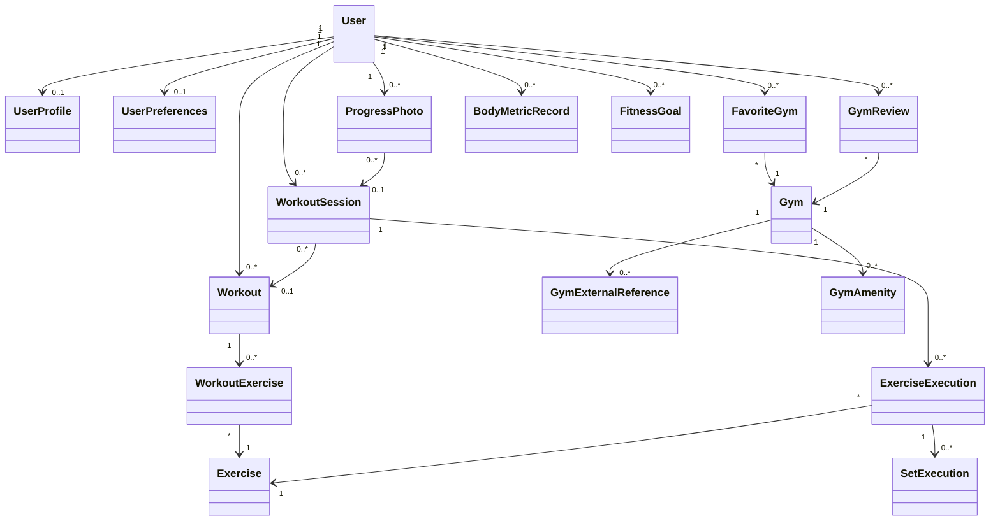

# FitMap v1 — Domain Model

## Document status

**Status:** Accepted
**Product:** FitMap  
**Version:** v1

**Related documents:**

- `../requirements/product-scope.md`
- `../requirements/functional-requirements.md`
- `../requirements/non-functional-requirements.md`
- `high-level-architecture.md`
- `decisions/`

This document describes the conceptual domain model of FitMap v1.

Its purpose is to define the main business concepts, responsibilities, relationships and invariants before they are translated into database schemas, API contracts or framework-specific models.

The domain model describes product meaning. It is not a direct representation of database tables or source-code classes.

---

# 1. Domain model principles

The FitMap domain model should:

- represent concepts that exist in the product problem space;
- preserve clear ownership of user data;
- distinguish planned workouts from executed workouts;
- preserve historical training data when workout templates change;
- distinguish FitMap-managed gym identity from external-provider data;
- avoid coupling domain rules to mobile UI, HTTP or persistence technology;
- keep private progress information private by default;
- support product evolution without introducing unnecessary complexity.

Implementation details may evolve while these domain meanings and invariants remain preserved.

---

# 2. Main domain areas

FitMap is organized around four primary domain areas:

## Identity

Responsible for users, profiles and user-specific preferences.

## Gyms

Responsible for gym identity, discovery-related information, favorites, amenities, external references and reviews.

## Training

Responsible for exercises, workout planning, workout execution and training history.

## Progress

Responsible for progress photos, body measurements, fitness goals and derived progress information.

These areas correspond to the primary business-module boundaries defined in the FitMap architecture.

---

# 3. Identity domain

## User

A `User` represents a person with a FitMap account.

A user owns or controls private product data such as:

- profile information;
- preferences;
- workouts;
- workout sessions;
- custom exercises;
- progress records;
- progress photos;
- favorite gyms;
- reviews.

Authentication credentials are associated with the account, but their secure representation is an architecture and security concern rather than a general-purpose domain attribute.

### Important rules

- private records must belong to the correct user;
- one user must not access another user's private information without authorization;
- ownership must be enforced by the backend;
- account and personal-data lifecycle behavior must follow the applicable product and privacy rules.

---

## UserProfile

`UserProfile` represents editable user-facing information associated with a user.

Candidate information may include:

- display name;
- profile image;
- fitness-related profile information.

The final profile attributes will be defined according to actual product needs and privacy considerations.

---

## UserPreferences

`UserPreferences` represents user-specific configuration that changes FitMap behavior without representing independent historical data.

Examples may include:

- fitness preferences;
- notification preferences;
- preferred measurement units;
- application preferences.

The preference model should remain limited to settings that provide actual product value.

---

# 4. Gyms domain

## Gym

A `Gym` represents a fitness facility that can be discovered or referenced by FitMap.

Gym information may include:

- name;
- geographic location;
- address;
- contact information;
- opening hours;
- images;
- amenities;
- external-provider references.

FitMap owns the stable identity of gyms that participate in persistent product relationships.

External search results do not automatically need to become permanent FitMap records. A durable FitMap gym identity is required when persistent relationships such as favorites or reviews depend on that gym.

### Important rules

- FitMap must not fabricate production gym information;
- unavailable external information remains unavailable;
- persistent user relationships reference the FitMap gym identity rather than a provider identifier;
- external-provider details must not define the core FitMap gym model.

---

## GymExternalReference

`GymExternalReference` represents the relationship between a FitMap gym and an external provider's place or gym identifier.

A FitMap gym may have references to multiple external providers over time.

Provider identifiers are integration references and must not become the primary identity of the FitMap gym.

The technical representation of these references belongs to persistence and integration implementation.

---

## GymAmenity

A `GymAmenity` represents a facility or capability associated with a gym.

Examples may include:

- weight-training area;
- cardio equipment;
- group classes;
- parking;
- accessibility-related facilities.

Amenities should only be presented when supported by trustworthy data.

---

## FavoriteGym

`FavoriteGym` represents the relationship between a user and a gym they have chosen to save.

### Important rules

- a favorite belongs to one user;
- a favorite references one gym;
- the same user must not have duplicate favorite relationships for the same gym;
- one user's favorites must not affect another user's favorites.

---

## GymReview

`GymReview` represents user-generated feedback associated with a gym.

A review may contain:

- rating;
- optional written content;
- creation date;
- update date.

### Important rules

- a review has an identifiable author;
- a review references a valid FitMap gym;
- a user may maintain at most one active review for the same gym;
- the author may edit their own active review;
- the author may remove their own review;
- removed reviews must not contribute to public presentation or aggregated ratings;
- one user cannot modify or remove another user's review through ordinary product functionality;
- public review content must not expose private user information unnecessarily.

Review history, moderation history and audit mechanisms may be introduced when product or operational requirements justify them.

The exact moderation, reporting and persistence strategy will be refined when these capabilities are implemented.

---

# 5. Training planning domain

The Training domain distinguishes what the user plans to perform from what the user actually performs.

This distinction is necessary to preserve trustworthy training history.

---

## Exercise

An `Exercise` represents a type of physical exercise that can be included in a workout.

Examples include:

- Barbell Bench Press;
- Squat;
- Lat Pulldown;
- Leg Press.

FitMap supports two exercise origins:

```text
FitMap-managed catalog exercise
                or
User-owned custom exercise
```

### Catalog exercises

Catalog exercises are shared FitMap product concepts and are not owned by individual users.

### Custom exercises

Authenticated users may create private custom exercises when the global catalog does not represent their training needs.

A custom exercise:

- belongs to the user who created it;
- is private by default;
- does not automatically become part of the global catalog;
- may be renamed or archived without invalidating historical training records.

Historical execution data must remain meaningful even if a custom exercise is later changed or made unavailable for new workout configuration.

The exact exercise taxonomy, catalog source, lifecycle mechanism and historical snapshot strategy will be refined as the exercise catalog and persistence model are implemented.

---

## Workout

A `Workout` represents a reusable training plan created or configured by a user.

Examples include:

- Push;
- Pull;
- Legs;
- Chest and Triceps;
- Workout A.

A workout describes planned training. It is not evidence that training actually occurred.

### Main responsibilities

- group exercises into a reusable training structure;
- preserve exercise ordering;
- define planned exercise configuration.

### Important rules

- a workout belongs to one user;
- editing a workout must not rewrite previously completed training history;
- a workout may temporarily contain no exercises while being configured;
- at least one exercise is required before a workout session can be started from that workout.

### Lifecycle

Workouts use an active or archived lifecycle.

An active workout is available for normal planning and for starting new workout sessions.

An archived workout is removed from normal active use but retains its identity and historical relationships.

Archiving must not remove or modify previously completed workout sessions.

Archived workouts may be restored.

Hard deletion is not part of the normal FitMap v1 workout lifecycle.

The technical persistence mechanism used to implement archival will be selected during persistence implementation.

---

## WorkoutExercise

`WorkoutExercise` represents the inclusion and planned configuration of an exercise within a workout.

It connects:

```text
Workout -> WorkoutExercise -> Exercise
```

It may contain planned information such as:

- position or order;
- target number of sets;
- target repetitions;
- target load when appropriate;
- notes.

The same `Exercise` may therefore have different planned configurations in different workouts.

For example:

```text
Workout A
Bench Press
4 x 8
60 kg
```

and:

```text
Workout B
Bench Press
3 x 12
45 kg
```

Both configurations reference the same exercise while representing different training plans.

---

# 6. Workout execution domain

## WorkoutSession

A `WorkoutSession` represents an actual occurrence of training performed by a user.

A workout session is historical data and is distinct from the reusable `Workout` template.

A session may originate from a configured workout, but completed session history must remain meaningful even if the original workout is later edited or archived.

### Main responsibilities

- identify when training occurred;
- associate executed exercises with the correct user;
- preserve historical training information;
- represent the lifecycle of an actual training session.

### Important rules

- a workout session belongs to one user;
- ownership cannot be transferred to another user;
- completed historical data must not be rewritten when a workout template changes;
- a session may be active, completed or cancelled according to the implemented lifecycle;
- a user may have at most one active workout session at a time.

When a session is already active, FitMap should require the user to resume, finish or cancel it before starting another session.

The exact database enforcement mechanism belongs to persistence implementation.

---

## ExerciseExecution

`ExerciseExecution` represents the execution of an exercise during a workout session.

It may record information such as:

- exercise identity;
- execution order;
- notes;
- completion state.

It represents what actually occurred during training rather than merely copying the planned `WorkoutExercise`.

---

## SetExecution

`SetExecution` represents an individual performed set within an `ExerciseExecution`.

It may record:

- set order;
- repetitions performed;
- load used;
- completion state.

Example:

```text
Bench Press

Set 1: 10 reps x 60 kg
Set 2: 10 reps x 60 kg
Set 3: 8 reps x 60 kg
Set 4: 7 reps x 60 kg
```

This historical execution data allows FitMap to derive meaningful training progression.

---

## Historical integrity

FitMap must preserve the distinction between:

```text
Workout
planned training template
```

and:

```text
WorkoutSession
historical training execution
```

For example, if a user completes a workout configured as `4 x 10` and later changes the workout template to `5 x 8`, the completed session must continue representing what actually occurred at the time.

Workout-template changes must never retroactively rewrite completed training history.

---

# 7. Progress domain

## ProgressPhoto

A `ProgressPhoto` represents an image intentionally recorded by a user as part of their fitness progress.

### Important rules

- a progress photo belongs to one user;
- progress photos are private by default;
- a photo has a relevant recording date;
- a photo exists independently from workout completion;
- taking a photo must not automatically mark an exercise or workout as completed.

A progress photo may optionally reference a `WorkoutSession` when the user intentionally associates the image with that session.

A workout session is not required to create a progress photo.

Removing or changing the optional session relationship must not remove the progress photo itself.

The photo binary is an infrastructure concern. The domain record represents the user-owned progress information, while private media storage is handled by the architecture defined for FitMap.

---

## BodyMetricRecord

`BodyMetricRecord` represents a body-related measurement recorded at a point in time.

Supported metric candidates include:

- body weight;
- waist measurement;
- chest measurement;
- arm measurement;
- thigh measurement;
- hip measurement.

Measurements should preserve:

- metric type;
- value;
- unit;
- recording date;
- owner.

Supported unit systems may include:

```text
Weight: kg / lb
Length: cm / in
```

Body metrics are personal progress records and are private by default.

FitMap treats these measurements as fitness-tracking information rather than clinical or diagnostic data.

The product should not infer diagnostic body-composition, metabolic or medical conclusions from measurements without a separate validated requirement.

---

## FitnessGoal

`FitnessGoal` represents a user-defined progress objective.

Candidate goals include:

- workout-frequency goals;
- body-weight goals;
- performance goals.

The supported goal types and calculation rules should be introduced only when the corresponding product behavior is implemented.

---

# 8. Derived progress information

Progress statistics should preferably be derived from trustworthy historical domain data rather than duplicated as manually maintained values.

Examples include:

- workouts completed;
- training frequency;
- exercise load progression;
- training consistency;
- historical body-weight trend.

For example:

```text
SetExecution history
        |
        v
load progression calculation
        |
        v
progress chart
```

Derived information may later be cached or materialized when actual performance requirements justify it.

---

# 9. Conceptual relationships

The primary conceptual relationships are:

```text
User
|-- UserProfile
|-- UserPreferences
|-- Custom Exercise
|-- FavoriteGym -> Gym -> GymExternalReference
|-- GymReview -> Gym
|-- Workout -> WorkoutExercise -> Exercise
|-- WorkoutSession
|   |-- source Workout (optional)
|   `-- ExerciseExecution -> SetExecution
|-- ProgressPhoto -> WorkoutSession (optional)
|-- BodyMetricRecord
`-- FitnessGoal
```

A workout may contain many workout exercises.

An exercise may be referenced by many workouts.

A user may have many historical workout sessions but at most one active session at a time.

A workout session may contain many exercise executions.

An exercise execution may contain many set executions.

A user may favorite multiple gyms.

A gym may be favorited by multiple users.

A user may create reviews over time while maintaining at most one active review for the same gym.

A progress photo may optionally reference a workout session without depending on that session for its existence.

---

# 10. Conceptual diagram



This diagram represents conceptual relationships and must not be interpreted as the final database schema.

---

# 11. Domain invariants

## User ownership

Private product records must belong to the correct authenticated user.

## Favorite uniqueness

A user must not have duplicate favorite relationships for the same gym.

## Stable gym identity

Persistent FitMap relationships must reference a stable FitMap gym identity rather than depending directly on an external-provider identifier.

## Review uniqueness

A user may have at most one active review for the same gym.

## Historical preservation

Changes to workouts or exercises must not retroactively invalidate or rewrite completed workout-session history.

## Historical ownership

A workout session cannot change ownership from one user to another.

## Single active session

A user may have at most one active workout session at a time.

## Progress privacy

Progress photos, body measurements and other private progress information are not public by default.

## Authentic gym data

Missing external gym information must not be replaced with fabricated production data.

## Review ownership

A user cannot modify or remove another user's review through ordinary product functionality.

## Execution accuracy

Recorded exercise execution represents what the user actually performed rather than automatically treating planned targets as completed results.

---

# 12. Value objects and supporting concepts

Some information may be represented as value objects or supporting types rather than independent entities.

Candidate examples include:

- geographic coordinates;
- address;
- distance;
- measurement value and unit;
- repetition target;
- load value;
- date range.

The final technical representation depends on the persistence and application design.

The presence of a concept in the domain model does not imply that a dedicated database table or source-code class must exist for it.

---

# 13. Concepts outside the initial Core scope

The following capabilities are outside the current FitMap Core scope:

- social feed;
- private messaging;
- personal trainer marketplace;
- payment processing;
- membership billing;
- wearable synchronization.

Introducing these areas would materially expand the product domain and should require an explicit product-scope decision.

---

# 14. Implementation-deferred details

Some details intentionally remain implementation decisions rather than unresolved domain architecture.

These include:

- final user-profile attributes;
- detailed exercise taxonomy and initial catalog population;
- technical archival representation;
- historical snapshot implementation;
- review moderation and audit mechanisms;
- exact body-metric validation ranges;
- supported fitness-goal calculation rules.

These details may be refined during implementation as long as the domain invariants defined in this document remain preserved.

---

# 15. Relationship to implementation

This domain model should guide:

- backend module boundaries;
- persistence design;
- API contracts;
- mobile feature organization;
- authorization rules;
- automated tests;
- backlog decomposition.

Domain concepts should not be mechanically converted into one database table or one source-code class each.

Implementation should preserve the meaning, ownership and invariants of the domain while remaining appropriate for the FitMap architecture.
