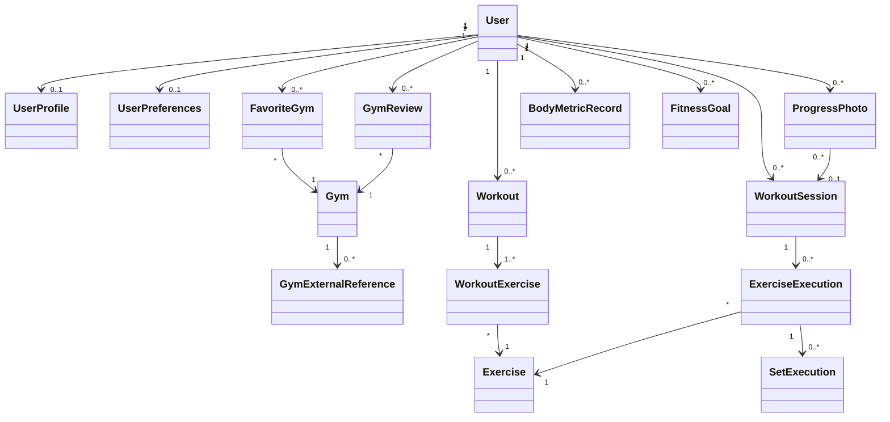

# FitMap v1 — Domain Model

## Document status

**Status:** Draft  
**Product:** FitMap  
**Version:** v1  

**Related documents:**

- `../requirements/product-scope.md`
- `../requirements/functional-requirements.md`
- `../requirements/non-functional-requirements.md`

This document describes the conceptual domain model of FitMap v1.

The purpose of this model is to define the main business concepts, responsibilities, relationships and invariants before database schemas, API contracts or framework-specific models are designed.

This document intentionally separates domain concepts from implementation details.

---

# 1. Domain model principles

The FitMap domain model should:

- represent concepts that exist in the product problem space;
- preserve clear ownership of user data;
- distinguish planned workouts from executed workouts;
- preserve historical training data even when workout templates change;
- distinguish external gym data from FitMap-managed user data;
- avoid coupling domain rules to mobile UI or database technology;
- support future product evolution without introducing unnecessary complexity.

The domain model is expected to evolve as architecture and user-experience decisions become more precise.

---

# 2. Main domain areas

FitMap currently contains four primary domain areas:

## Identity and Profile

Responsible for the FitMap user and user-specific preferences.

## Gym Discovery

Responsible for gym identity, discovery-related information, favorites and gym-related user interactions.

## Training

Responsible for workout planning, exercises, workout execution and training history.

## Progress

Responsible for user progress records derived from training activity or manually registered progress information.

User-generated gym reviews are related to the Gym Discovery domain but have additional moderation and ownership concerns.

---

# 3. Identity and Profile domain

## User

A `User` represents a person with a FitMap account.

A user owns or controls private product data such as:

- profile information;
- workouts;
- workout sessions;
- custom exercises;
- progress records;
- progress photos;
- favorite gyms;
- reviews;
- preferences.

Authentication credentials are associated with the user account but their secure representation is an architecture and security concern rather than a domain attribute exposed throughout the product.

### Main responsibilities

- represent the identity of a FitMap account;
- provide ownership boundaries for private data;
- associate user-specific product behavior with the correct account.

### Important rules

- private data must always belong to exactly the correct user;
- one user must never gain access to another user's private records without explicit authorization;
- account deletion must follow the approved personal-data lifecycle.

---

## UserProfile

`UserProfile` represents editable user-facing information associated with a user.

Candidate information may include:

- display name;
- profile image;
- fitness-related preferences.

The final profile attributes will be defined according to actual product needs and privacy considerations.

---

## UserPreferences

`UserPreferences` represents user-specific configuration that changes FitMap behavior without representing independent domain history.

Examples may include:

- fitness preferences;
- notification preferences;
- preferred measurement units;
- application preferences.

The exact preference model will be refined later.

---

# 4. Gym Discovery domain

## Gym

A `Gym` represents a fitness facility that can be discovered or referenced by FitMap.

Conceptually, a gym may contain information such as:

- name;
- geographic location;
- address;
- contact information;
- opening hours;
- images;
- amenities;
- external-provider references.

The existence of the `Gym` domain concept does not yet determine whether every gym will be permanently persisted in the FitMap database.

That persistence strategy will be decided during architecture.

### Important rules

- FitMap must not fabricate production gym information and present it as real data;
- unavailable data must remain explicitly unavailable;
- a gym referenced by FitMap user data must have a stable identity suitable for favorites, reviews and other relationships.

### Accepted identity rule

FitMap maintains its own stable identity for gyms that participate in persistent product relationships.

External provider identifiers are treated as provider-specific references and must not become the primary domain identity of a gym.

A FitMap gym may be associated with multiple external references over time.

Persistent relationships such as favorites and reviews must reference the FitMap gym identity rather than an external provider identifier.

---

## GymExternalReference

`GymExternalReference` conceptually represents the relationship between a FitMap gym identity and an external provider's gym or place identifier.

A gym may have multiple external references when FitMap obtains information from more than one provider or when provider relationships evolve over time.

### Important rules

- an external reference belongs to one FitMap gym;
- an external reference identifies the external provider and provider-specific resource;
- provider identifiers are not substitutes for the FitMap gym identity;
- changes in external providers must not invalidate FitMap-owned persistent relationships.

The final representation will depend on the selected gym-data architecture.

---

## GymAmenity

A `GymAmenity` represents a capability or facility available at a gym.

Examples may include:

- weight-training area;
- cardio equipment;
- group classes;
- parking;
- accessibility-related facilities.

Amenities should only be displayed when supported by trustworthy data.

---

## FavoriteGym

`FavoriteGym` represents the relationship between a user and a gym the user has chosen to save.

### Important rules

- a favorite belongs to one user;
- a favorite references one FitMap gym identity;
- the same gym should not create duplicate favorite relationships for the same user;
- one user's favorites must not affect another user's favorites.

---

# 5. Gym Reviews domain behavior

## GymReview

A `GymReview` represents user-generated feedback associated with a gym.

A review may contain:

- rating;
- optional written content;
- creation date;
- update date.

### Important rules

- a review must have an identifiable author;
- a review must reference a valid FitMap gym identity;
- only the author or an authorized moderation process may modify or remove a review;
- public written reviews require an appropriate moderation and reporting strategy;
- review behavior must not expose private user information unnecessarily.

### Accepted review rule

A user may maintain at most one active review for the same gym.

A review may contain a rating and optional written content according to the approved review policy.

The author may edit their own active review instead of creating multiple simultaneous active reviews for the same gym.

The author may remove their own review.

A removed review must no longer contribute to public review presentation or aggregated gym rating calculations.

Review history, moderation history and audit mechanisms may be introduced later if required, but they are not required as user-facing FitMap v1 functionality.

The exact moderation, reporting and persistence strategy will be defined during architecture and implementation design.

---

# 6. Training domain

The training domain distinguishes between:

1. what the user plans to do;
2. what the user actually performs.

This separation is essential for preserving meaningful training history.

---

## Exercise

An `Exercise` represents a type of physical exercise that can be included in a workout.

Examples:

- Barbell Bench Press;
- Squat;
- Lat Pulldown;
- Leg Press.

An exercise may originate from:

- a FitMap-managed exercise catalog;
- a user-created custom exercise.

### Candidate attributes

- name;
- description;
- exercise category;
- target muscle groups;
- equipment requirements;
- ownership or source when the exercise is custom.

### Accepted catalog rule

FitMap maintains a managed global exercise catalog while allowing authenticated users to create private custom exercises when the catalog does not represent their training needs.

Catalog exercises are shared product concepts and are not owned by individual users.

Custom exercises belong to the user who created them and are private by default.

Creating a custom exercise must not automatically publish or promote that exercise into the global FitMap catalog.

The user experience should prefer existing catalog exercises when appropriate while still allowing legitimate custom exercise variations.

Custom exercise lifecycle changes must not invalidate previously recorded workout history.

Historical exercise execution must remain meaningful even when a custom exercise is renamed, archived or otherwise made unavailable for new workout configuration.

The exact exercise taxonomy, catalog source, lifecycle mechanism and historical snapshot strategy will be defined during architecture and persistence design.

---

## Workout

A `Workout` represents a reusable training plan created or configured by a user.

Examples:

- Push;
- Pull;
- Legs;
- Chest and Triceps;
- Workout A.

A workout describes planned activity and is not itself proof that training occurred.

### Main responsibilities

- group exercises into a reusable training structure;
- preserve exercise ordering;
- define planned exercise configuration.

### Important rules

- a workout belongs to one user;
- modification of a workout must not corrupt previously completed workout history;
- lifecycle changes to a workout must preserve historical sessions that were already completed.

### Accepted lifecycle rule

Workouts have an active or archived lifecycle.

An active workout is available for normal workout planning and for starting new workout sessions.

An archived workout is removed from normal active use but retains its identity and historical relationships.

Archiving a workout must not delete, invalidate or rewrite previously completed workout sessions.

Archived workouts may be restored to active status.

Hard deletion is not part of the normal FitMap v1 workout lifecycle.

The technical persistence mechanism used to implement archival will be defined during architecture and database design.

---

## WorkoutExercise

A `WorkoutExercise` represents the inclusion and planned configuration of an exercise inside a workout.

It connects:

`Workout -> Exercise`

and may define information such as:

- order;
- target number of sets;
- target repetitions;
- target load when appropriate;
- notes.

`WorkoutExercise` is necessary because the same exercise may have different planned configurations in different workouts.

Example:

```text
Workout A
Bench Press
4 x 8
60 kg
```

and:

```text
Workout B
Bench Press
3 x 12
45 kg
```

Both reference the same `Exercise`, but their planned configurations are different.

---

# 7. Workout execution domain

## WorkoutSession

A `WorkoutSession` represents an actual occurrence of training performed by a user.

A session is historical data.

Example:

```text
Workout A
September 13, 2026
Started: 18:05
Finished: 19:12
```

### Main responsibilities

- identify when training occurred;
- associate executed exercises with the user;
- preserve historical training information.

### Important rules

- a workout session belongs to one user;
- completed historical data must remain valid even if the original workout is later edited;
- a session may originate from a configured workout;
- session lifecycle rules must distinguish active, completed and cancelled sessions where required.

### Accepted active-session rule

A user may have at most one active workout session at a time.

Starting a new workout session while another session is active must not create a second simultaneous active session for the same user.

When an active session already exists, FitMap should direct the user to resume, finish or cancel that session before another workout session can be started.

This restriction applies only to active sessions and does not limit the number of completed or cancelled historical workout sessions associated with a user.

The exact technical enforcement mechanism will be defined during architecture and persistence design.

---

## ExerciseExecution

`ExerciseExecution` represents the execution of one exercise during a workout session.

It may record:

- exercise identity;
- execution order;
- notes;
- completion status;
- historical information required to keep the execution understandable over time.

It separates the planned `WorkoutExercise` from what actually happened during training.

Historical execution data must not depend exclusively on mutable current exercise configuration when doing so would make past sessions inaccurate or ambiguous.

---

## SetExecution

`SetExecution` represents an individual performed set during an exercise execution.

It may record:

- set order;
- repetitions performed;
- load used;
- completion state.

Example:

```text
Bench Press

Set 1: 10 reps x 60 kg
Set 2: 10 reps x 60 kg
Set 3: 8 reps x 60 kg
Set 4: 7 reps x 60 kg
```

This model allows FitMap to calculate meaningful training progression from actual data rather than only planned values.

---

# 8. Historical integrity

FitMap must preserve the difference between:

```text
Workout
planned training template
```

and:

```text
WorkoutSession
historical training execution
```

Consider the following situation:

1. A user completes Workout A on September 10.
2. Workout A contains Bench Press with `4 x 10`.
3. On September 15 the user edits Workout A to `5 x 8`.

The September 10 history must continue representing what actually occurred on September 10.

Editing the workout template must not rewrite historical training data.

The same principle applies when:

- a workout is archived;
- a custom exercise is renamed or archived;
- current exercise targets change;
- other mutable planning data changes after execution.

This rule will influence persistence and API architecture.

---

# 9. Progress domain

## ProgressPhoto

A `ProgressPhoto` represents an image intentionally recorded by a user as part of their fitness progress.

### Important rules

- the photo belongs to one user;
- progress photos are private by default;
- the photo has a relevant recording date;
- taking a photo must not automatically determine whether an exercise was completed.

Image binary storage is an infrastructure concern and should not be confused with the conceptual progress record.

### Accepted relationship rule

A progress photo exists independently as a user-owned progress record.

A progress photo may optionally reference a workout session when the user intentionally associates the photo with that training session.

A workout session is not required in order to create a progress photo.

Removing or changing the optional workout-session relationship must not remove the progress photo itself.

Progress photos remain private by default regardless of whether they are associated with a workout session.

The exact media-storage and persistence strategy will be defined during architecture and infrastructure design.

---

## BodyMetricRecord

`BodyMetricRecord` represents a body-related measurement recorded at a specific point in time.

A body metric is historical information rather than only the user's current measurement.

### Initial metric types

The controlled metric set may initially include:

- body weight;
- waist circumference;
- chest circumference;
- arm circumference;
- thigh circumference;
- hip circumference.

Additional metric types should require an explicit product decision rather than unrestricted free-form metric definitions.

### Accepted metric rule

Body metrics are stored as time-based user-owned measurements with an explicit metric type, numeric value, unit and recording date.

Each measurement belongs to exactly one user.

Measurement values and units must be represented separately rather than stored as arbitrary combined text.

Supported units must be controlled and appropriate to the metric type.

Examples may include:

- `kg` and `lb` for body weight;
- `cm` and `in` for body circumferences.

Historical measurements must remain available so that FitMap can derive progress trends over time.

FitMap must not silently reinterpret historical values when a user's preferred display unit changes.

Automatic clinical interpretation, diagnosis or health assessment is outside the purpose of this domain concept.

Metrics such as automatically estimated body-fat percentage, diagnostic BMI interpretation or metabolic assessment are not part of the initial model.

This concept remains in the Differentiator product scope and should not increase Core implementation complexity prematurely.

The exact persistence representation, conversion strategy and validation ranges will be defined during architecture and implementation design.

---

## FitnessGoal

`FitnessGoal` represents a user-defined progress objective.

Candidate examples include:

- workout-frequency goal;
- body-weight goal;
- performance goal.

The supported goal types and progress calculation rules must be defined before implementation.

This concept belongs to the Differentiator scope.

---

# 10. Derived progress information

Statistics and progress charts should preferably be derived from trustworthy domain data instead of being stored as independent duplicated facts when unnecessary.

Examples:

- number of workouts completed;
- training frequency;
- exercise load progression;
- training consistency;
- historical body-weight trend.

For example:

```text
SetExecution history
        |
        v
load progression calculation
        |
        v
progress chart
```

rather than manually maintaining a separate field containing the same derived value.

Derived data may still be cached or materialized later for performance reasons if architecture and measurements justify it.

---

# 11. Conceptual relationships

The initial conceptual relationships are:

```text
User
|-- UserProfile
|-- UserPreferences
|-- Custom Exercise
|-- FavoriteGym
|   `-- Gym
|       `-- GymExternalReference
|-- GymReview
|   `-- Gym
|-- Workout
|   `-- WorkoutExercise
|       `-- Exercise
|-- WorkoutSession
|   `-- ExerciseExecution
|       `-- SetExecution
|-- ProgressPhoto
|   `-- WorkoutSession (optional)
|-- BodyMetricRecord
`-- FitnessGoal
```

A workout may contain many workout exercises.

An exercise may be referenced by many workouts.

Catalog exercises may be shared by many users.

A custom exercise belongs to one user.

A user may have many workout sessions over time but at most one active workout session at a time.

A workout session may contain many exercise executions.

An exercise execution may contain many set executions.

A user may favorite multiple gyms.

A gym may be favorited by multiple users.

A FitMap gym may have multiple external-provider references.

A user may maintain at most one active review for a specific gym.

A progress photo may optionally reference one workout session.

A user may have many body metric records over time.

---

# 12. Conceptual diagram



This diagram represents conceptual relationships and must not be interpreted as the final database schema.

The distinction between catalog exercises and user-owned custom exercises is conceptual at this stage and does not imply an inheritance-based implementation.

---

# 13. Domain invariants

The following invariants are important candidates for the FitMap domain:

## User ownership

Private product records must always belong to the correct user.

## Stable gym identity

Persistent FitMap relationships must reference a stable FitMap gym identity rather than depending directly on an external provider identifier.

## Favorite uniqueness

A user should not have duplicate favorite relationships for the same gym.

## Custom exercise privacy

A user-created custom exercise is private to its owner by default and must not automatically become part of the global catalog.

## Workout lifecycle

A workout is active or archived within the normal FitMap v1 lifecycle.

Archiving must not destroy historical workout sessions.

## Active-session uniqueness

A user may have at most one active workout session at a time.

## Historical preservation

Changes to workout templates or mutable exercise configuration must not retroactively modify completed workout-session history.

## Historical ownership

A workout session cannot change ownership from one user to another.

## Progress privacy

Progress photos and private progress information are not public by default.

## Progress-photo independence

A progress photo does not require a workout session in order to exist.

## Body-metric history

Body measurements represent time-based historical records and must preserve their recorded value, unit and date.

## Authentic gym data

Missing external gym information must not be replaced by fabricated production data.

## Review uniqueness

A user may maintain at most one active review for the same gym.

## Review ownership

A user cannot modify or delete another user's review through ordinary product functionality.

## Execution accuracy

Recorded exercise execution should represent what the user actually performed rather than automatically copying planned targets as completed results.

These invariants will be reviewed during architecture and implementation design.

---

# 14. Value objects and supporting concepts

Some information may be represented as value objects rather than independent entities.

Candidate examples include:

- geographic coordinates;
- address;
- distance;
- measurement value and unit;
- repetition target;
- load value;
- date range.

The final representation depends on the programming and persistence model selected later.

The existence of a concept in this section does not imply that a database table should exist for it.

---

# 15. Concepts intentionally excluded from the initial Core domain

The following areas are outside the current Core domain:

- social feed;
- private messaging;
- personal trainer marketplace;
- payment processing;
- membership billing;
- wearable synchronization.

Introducing these concepts would significantly expand the FitMap domain and should require an explicit product-scope decision.

---

# 16. Resolved domain decisions

The following domain decisions were reviewed and accepted during the initial FitMap v1 domain-modeling phase.

## Gym identity

FitMap maintains its own stable gym identity for persistent product relationships.

External provider identifiers are references associated with a FitMap gym and are not the primary domain identity used by favorites, reviews or other persistent relationships.

## Exercise catalog

FitMap uses a managed global exercise catalog while allowing authenticated users to create private custom exercises.

Custom exercise lifecycle changes must not invalidate previously recorded workout history.

## Workout lifecycle

Workouts use an active or archived lifecycle.

Archiving removes a workout from normal active use without deleting its historical workout sessions.

Archived workouts may be restored.

Hard deletion is not part of the normal FitMap v1 workout lifecycle.

## Active workout session

A user may have at most one active workout session at a time.

An existing active session must be resumed, finished or cancelled before another session can be started.

## Gym review policy

A user may maintain at most one active review for the same gym.

The author may edit or remove their own review.

Removed reviews must no longer participate in public review presentation or aggregated gym rating calculations.

## Progress-photo relationship

Progress photos exist independently as user-owned progress records.

A progress photo may optionally reference a workout session, but a workout session is not required to create or retain a progress photo.

## Body metrics

Body metrics are modeled as historical user-owned measurements with a controlled metric type, numeric value, explicit unit and recording date.

The initial model is limited to non-clinical progress tracking and does not provide automatic clinical interpretation.

Body metrics remain in the Differentiator product scope.

---

# 17. Relationship to implementation

This domain model should influence:

- backend module boundaries;
- database modeling;
- API contracts;
- mobile feature organization;
- authorization rules;
- test strategy;
- documentation;
- backlog decomposition.

However, domain concepts should not be mechanically converted into one database table or one source-code class each.

Implementation design must preserve domain meaning while remaining appropriate for the selected architecture.

---

# 18. Next steps

Before implementation begins, the next modeling activities should include:

1. review the domain concepts and terminology;
2. validate conceptual relationships and domain invariants;
3. define major module boundaries;
4. define the high-level system architecture;
5. document significant architectural decisions through ADRs;
6. design the persistence model;
7. design API boundaries and contracts;
8. decompose implementation work into traceable GitHub Issues.