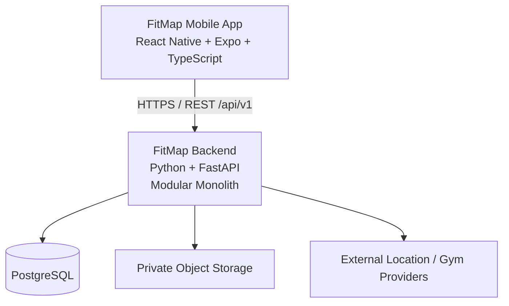

# FitMap High-Level Architecture

## Overview

FitMap is a mobile fitness platform that combines gym discovery with workout planning, execution history and personal progress tracking.

The system is composed of a React Native mobile application, a Python backend API and supporting persistence and external services.

The initial architecture favors clear boundaries and operational simplicity over distributed-system complexity.

## System Context



The mobile application communicates with the FitMap backend through a versioned REST API.

Business data is not accessed directly from the mobile application.

## Mobile Application

The mobile application uses:

- React Native;
- Expo;
- TypeScript.

The existing prototype will evolve incrementally rather than being rewritten.

Sensitive session credentials are stored using secure platform storage, while non-sensitive local state may use general-purpose local persistence.

Backend communication is centralized behind an application API client rather than being implemented independently by individual screens.

## Backend

The backend uses Python and FastAPI and is deployed as a modular monolith.

FastAPI is responsible for the HTTP delivery layer. Business behavior remains separated from HTTP, persistence and external-provider details.

The backend is organized around four primary business modules:

```text
Identity
Gyms
Training
Progress
```

### Identity

Owns user identity, profiles, preferences, authentication and sessions.

### Gyms

Owns gym discovery, FitMap gym identity, favorites, reviews and external gym/provider relationships.

### Training

Owns exercises, workouts, workout sessions, execution records and training history.

### Progress

Owns progress photos, body measurements, fitness goals and progress-oriented capabilities.

Modules communicate through explicit application boundaries and should not depend directly on another module's internal persistence implementation.

## Persistence

PostgreSQL is the primary transactional database.

The application uses SQLAlchemy for relational persistence and Alembic for schema migrations.

The database is physically shared by the modular monolith, while data ownership remains logically associated with the responsible module.

Important domain constraints are protected through both application rules and database integrity mechanisms where appropriate.

## Authentication

Authentication is managed by the backend.

The initial authentication model uses:

```text
email/password
        |
        v
short-lived access token
        +
rotating refresh session
```

Passwords are stored using Argon2id rather than plaintext or general-purpose hashes.

Authorization and resource ownership are always enforced by the backend.

The mobile client is not trusted to choose ownership through arbitrary user identifiers.

## Media

Progress-photo files are stored in private object storage.

PostgreSQL stores the corresponding FitMap metadata and storage references.

Media access is authorized by the backend, with temporary upload or download authorization used where appropriate.

Device-local file URIs are not treated as durable FitMap media references.

## External Providers

Gym discovery, geocoding and routing integrations are isolated behind backend provider adapters.

External response formats and identifiers do not define FitMap domain models.

FitMap maintains its own persistent gym identity when durable relationships such as favorites or reviews require one.

Unavailable provider data remains unavailable rather than being replaced with fabricated production data.

## API

The mobile application communicates with the backend through:

```text
HTTPS
REST
JSON
/api/v1
```

API contracts are separate from domain and persistence models.

The API uses consistent validation, error responses, authentication and bounded collection access.

Domain operations may use explicit actions when generic CRUD does not correctly represent the business behavior.

## Configuration and Environments

Runtime configuration is external to application source code.

The architecture distinguishes:

```text
development
test
staging
production
```

Local `.env` files may be used for development but are not committed.

A version-controlled `.env.example` documents required configuration.

Backend secrets remain server-side and are never embedded in the distributed mobile application.

## Quality

Backend quality includes:

```text
pytest
Ruff
static type checking
PostgreSQL integration tests
migration validation
```

Mobile quality includes:

```text
TypeScript strict mode
ESLint
Prettier
Jest
React Native Testing Library
```

Testing prioritizes business, security and regression risk rather than arbitrary coverage targets.

## Observability

The initial operational strategy includes:

```text
structured logs
request correlation
health and readiness checks
essential metrics
centralized error reporting
security-relevant events
```

Telemetry must not expose authentication credentials, secrets or unnecessary personal information.

More advanced tracing infrastructure may be introduced if operational complexity later justifies it.

## Delivery

The backend is packaged as a Docker image.

Docker Compose is used for local integration where appropriate.

GitHub Actions provides automated validation and will progressively support deployment workflows.

The intended delivery flow is:

```text
Feature Branch
      |
      v
Pull Request
      |
      v
CI
      |
      v
Main
      |
      v
Immutable Backend Build
      |
      v
Staging
      |
      v
Production
```

Database migrations are executed as a controlled deployment step.

Mobile builds follow the Expo/EAS-compatible build and release workflow.

Kubernetes and Infrastructure as Code platforms are not initial requirements and will only be introduced if operational needs justify them.

## Architecture Principles

FitMap follows a small set of guiding principles:

1. Prefer the simplest architecture that satisfies real product requirements.
2. Keep business rules independent from delivery and infrastructure details.
3. Protect module ownership and avoid arbitrary cross-module coupling.
4. Treat security, testing and data integrity as application requirements rather than later additions.
5. Introduce infrastructure only when its value justifies its operational cost.
6. Preserve the ability to evolve without designing prematurely for hypothetical scale.

## Architecture Decisions

Significant architectural choices are documented in:

`docs/architecture/decisions/`

ADRs record decisions that benefit from retaining their context and rationale. Implementation details that do not require architectural history should remain in the relevant code or technical documentation instead.

## Related Documentation

- `domain-model.md`
- `../requirements/product-scope.md`
- `../requirements/functional-requirements.md`
- `../requirements/non-functional-requirements.md`
- `decisions/`